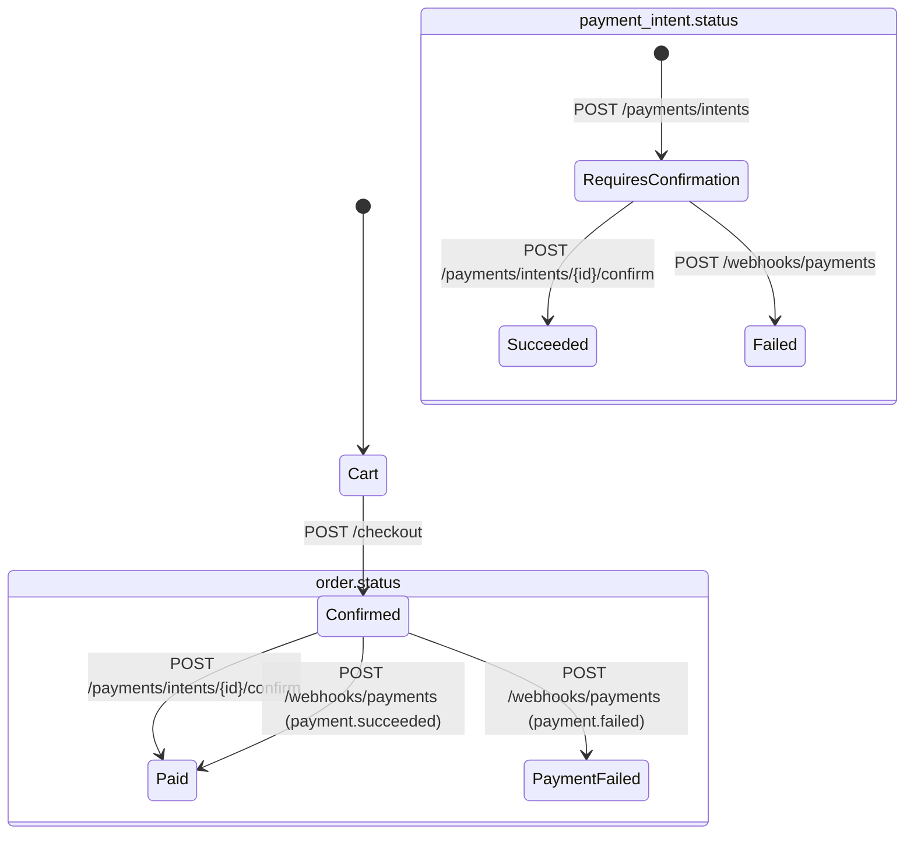
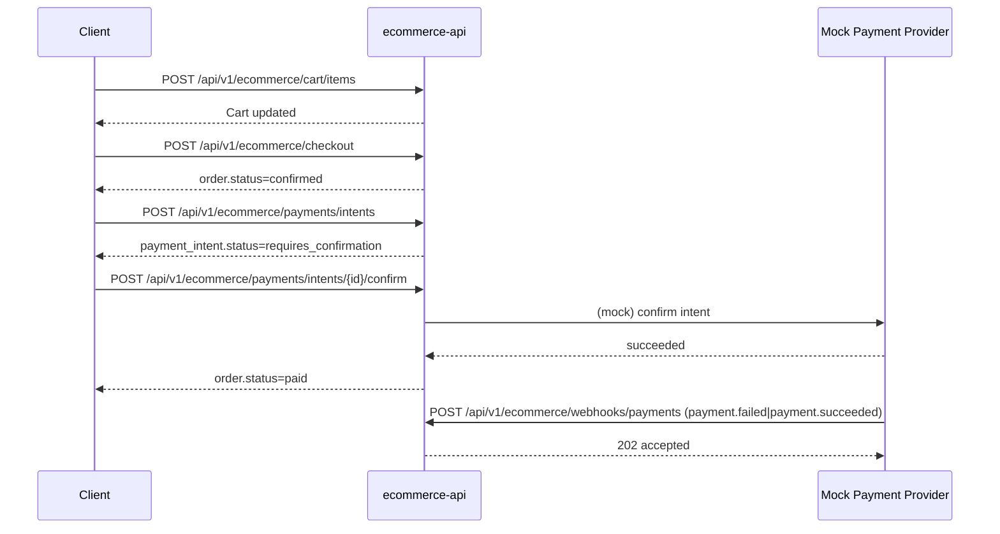

# E-Commerce API

**Part of [quickstart-workspace](../README.md)** - A production-style FastAPI commerce backend built with RapidKit modules.

**Related Articles:**
- Medium: [From Zero to Production FastAPI with RapidKit: Build a Real E-Commerce API](https://medium.com/@rapidkit/from-zero-to-production-fastapi-with-rapidkit-build-a-real-e-commerce-api-80390a34ffe3)
- Dev.to: [Build a Production-Ready FastAPI E-Commerce API with RapidKit (Step-by-Step)](https://dev.to/rapidkit/build-a-production-ready-fastapi-e-commerce-api-with-rapidkit-step-by-step-llm)

## 🚀 What's Included

This project demonstrates a practical ecommerce service with:

- ✅ Product catalog endpoints
- ✅ Cart lifecycle (add/list/clear)
- ✅ Checkout flow with order creation
- ✅ Inventory guards (insufficient stock protection)
- ✅ Module health endpoints under `/api/health/module/*`
- ✅ Docker, tests, linting, and CI templates

**Installed RapidKit modules:**
- `settings`
- `logging`
- `deployment`
- `middleware`
- `db_postgres`
- `auth_core`
- `redis`
- `security_headers`

## ⚡ Quick Start

### 1) Start infrastructure

```bash
docker-compose up -d postgres redis
```

### 2) Bootstrap environment

```bash
source .rapidkit/activate
rapidkit init
```

### 3) Run server

```bash
rapidkit dev
```

API docs: `http://localhost:8000/docs`

## 🧪 Main Endpoints

- `GET /health`
- `GET /api/v1/ecommerce/products`
- `GET /api/v1/ecommerce/products/search`
- `POST /api/v1/ecommerce/products`
- `POST /api/v1/ecommerce/products/seed`
- `POST /api/v1/ecommerce/cart/items`
- `GET /api/v1/ecommerce/cart`
- `POST /api/v1/ecommerce/checkout`
- `GET /api/v1/ecommerce/orders/{order_id}`
- `POST /api/v1/ecommerce/payments/intents`
- `POST /api/v1/ecommerce/payments/intents/{intent_id}/confirm`
- `POST /api/v1/ecommerce/webhooks/payments`
- `GET /api/health/module/postgres`
- `GET /api/health/module/redis`

## 🧭 Demo Flow

```bash
# seed sample catalog
curl -s -X POST http://localhost:8000/api/v1/ecommerce/products/seed

# create product
curl -s -X POST http://localhost:8000/api/v1/ecommerce/products \
	-H "Content-Type: application/json" \
	-d '{"sku":"SKU-100","name":"Wireless Keyboard","price":"79.99","currency":"USD","stock":10}'

# search products
curl -s "http://localhost:8000/api/v1/ecommerce/products/search?q=keyboard&min_price=50&max_price=150&in_stock=true"

# add to cart
curl -s -X POST http://localhost:8000/api/v1/ecommerce/cart/items \
	-H "Content-Type: application/json" \
	-d '{"product_id":"<PRODUCT_ID>","quantity":2}'

# checkout
curl -s -X POST http://localhost:8000/api/v1/ecommerce/checkout \
	-H "Content-Type: application/json" \
	-d '{"customer_email":"buyer@example.com"}'

# create mock payment intent
curl -s -X POST http://localhost:8000/api/v1/ecommerce/payments/intents \
	-H "Content-Type: application/json" \
	-d '{"order_id":"<ORDER_ID>","provider":"mockpay"}'

# confirm mock payment
curl -s -X POST http://localhost:8000/api/v1/ecommerce/payments/intents/<INTENT_ID>/confirm \
	-H "Content-Type: application/json" \
	-d '{"gateway_reference":"gw-demo-001"}'

# simulate provider webhook
curl -s -X POST http://localhost:8000/api/v1/ecommerce/webhooks/payments \
	-H "Content-Type: application/json" \
	-d '{"event_type":"payment.succeeded","payment_intent_id":"<INTENT_ID>","order_id":"<ORDER_ID>","status":"succeeded"}'
```

## 🔁 Order & Payment State Flow

`order.status` lifecycle in this example:

- `confirmed` → after successful checkout (`POST /checkout`)
- `paid` → after payment intent confirmation or a `payment.succeeded` webhook
- `payment_failed` → after `payment.failed` webhook

`payment_intent.status` lifecycle in this example:

- `requires_confirmation` → after creating payment intent
- `succeeded` → after confirm endpoint
- `failed` (or custom provider status) → after webhook event update

This keeps checkout and payment processing decoupled, which matches production integration patterns.



## 🔄 Request Sequence (Client → API → Payment → Webhook)



## ✅ Quality Gates

```bash
make lint
make typecheck
make test
make audit
```

## 📄 License

MIT License. See `LICENSE`.